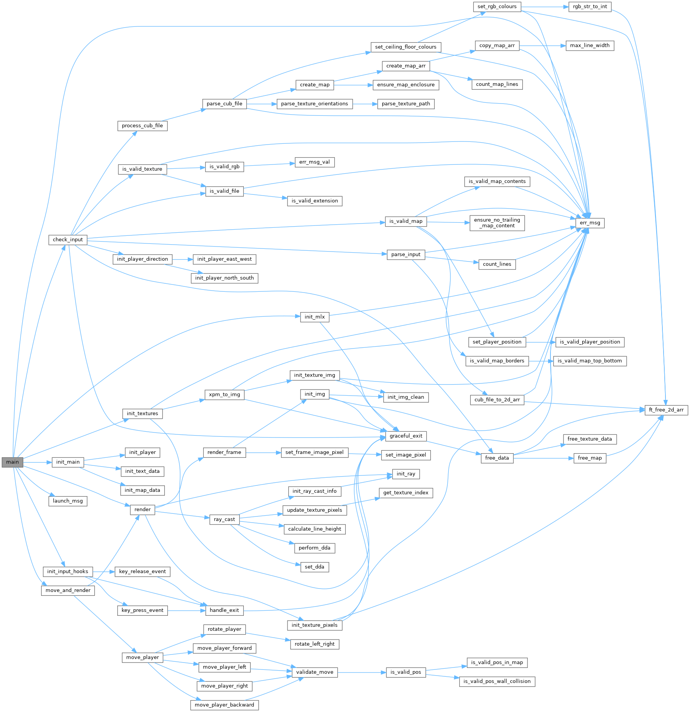

# 42 Cub3D 🧊

**Cub3D** is a **Wolfenstein 3D-inspired** raycasting project developed as part of the 42 curriculum. It provides a **basic 3D rendering engine** using **raycasting**

## Features

- **Raycasting Engine**: Implements a first-person perspective using raycasting.
- **Textured Walls & Floor Casting**: Supports wall textures and basic floor and ceiling rendering.
- **Player Movement**: Includes rotation and movement with some collision detection.
- **Configurable Map Parsing**: Reads `.cub` files defining walls, textures, and player spawn.

## Installation and Usage

1. Clone the repository:
   ```sh
   git clone https://github.com/romanmikh/cub3d.git
   cd cub3d
   make
   ./cub3d ./maps/nature.cub
   ```

3. The project uses ...

4. High-level project architecture:

   - **src/**:
     - **check_parse/**: ...
     - **dynamics/**: ...
     - **exit/**: ...
     - **graphics/**: ...
     - **init/**: ...
   - **inc/**:
     - `cub3d.h`: ...
   - **libft/**: ...
   - **textures/**: ...
   - **maps/**: ...
   - **minilib-linux/**: ...

5. Valgrind output saved in valgrind_out.txt after:
   ```sh
   ulimit -n 2014 # necessary once only, to address 'file descriptor too high' error
   make valgrind
   ```

## Helpful Resources
1. https://www.youtube.com/watch?v=8gIhNSAXYcQ&ab_channel=AndrePrihodko (quick intuition)
2. https://www.youtube.com/watch?v=W5P8GlaEOSI&ab_channel=AbdulBari (detailed introduction)
3. https://reactive.so/post/42-a-comprehensive-guide-to-cub3d/ (code example)
4. https://harm-smits.github.io/42docs/projects/cub3d (detailed explanation)

## Full Code Map
